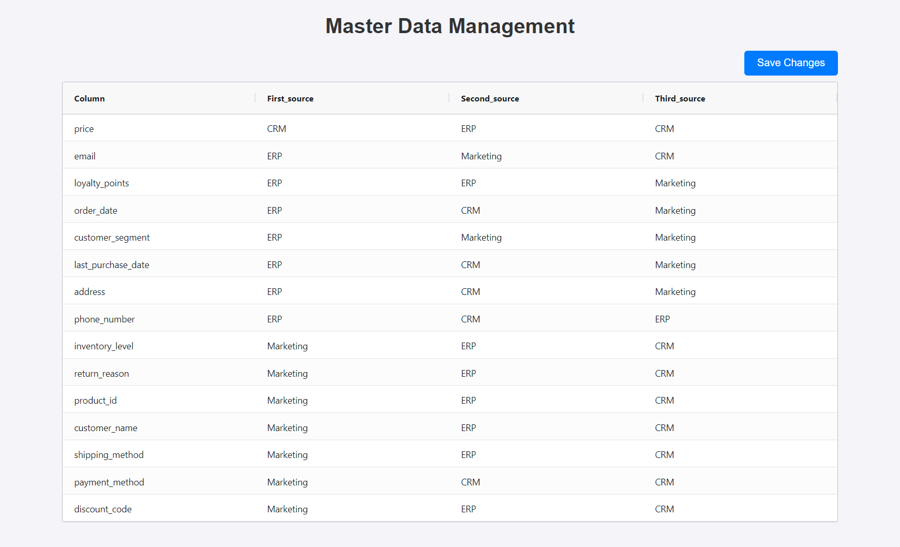

# 🎛️ Master Data Manager

## 🖼️ Project Screenshot

## 🚀 Project Overview

In many companies, business users need to edit data at the data warehouse level. This project demonstrates one approach to enable this, using master data source system precedence as an example. 

The application allows business users to decide which source systems should be used to pull data for columns that have data from multiple source systems. This is crucial for maintaining data quality and consistency across the organization.

## ✨ Features

- 🌐 Interactive web interface for viewing and editing column precedence data
- ⚡ Data viewing and editing with AG Grid
- 🔙 Backend API built with FastAPI
- 💾 Data storage and retrieval using Google BigQuery
- ☁️ Deployment-ready for Azure App Service

## 🛠️ Tech Stack

  
  
  
  
  
  
  

- Frontend: HTML, JavaScript, AG Grid
- Backend: Python, FastAPI
- Database: Google BigQuery
- Deployment: Azure App Service

## 🔧 How It Works

1. 📊 The application displays a grid showing columns and their current source system precedence (first, second, and third choices).
2. ✏️ Business users can edit the precedence directly in the grid.
3. 💾 Changes are collected and can be saved in bulk.
4. 🔄 The backend processes these changes and updates the BigQuery table.
5. 📈 The updated data is then reflected in downstream data processes (in theory, not actually), ensuring that data is pulled from the correct source systems according to the latest precedence rules.

## 🧩 Key Components

- `main.py`: FastAPI application handling API requests and BigQuery interactions
- `index.html`: Frontend interface using AG Grid for data display and editing
- BigQuery table: Stores the column precedence data

## 🔒 Security Considerations

- 🚦 Rate limiting to prevent API abuse
- ✅ Input validation to ensure data integrity
- 🛡️ Prepared statements for BigQuery interactions to prevent SQL injection
- 🔐 Authentication and authorization (to be implemented for production use)

## 🚀 Deployment

The application is designed to be deployed on Azure App Service, allowing for easy scaling and management.

## 🔮 Future Enhancements

- 👤 Implement user authentication and role-based access control
- 📝 Add audit logging for all changes
- 🖥️ Develop a more comprehensive UI for managing other aspects of master data

## 💡 Why This Matters

A perennial problem I've found working for tons of clients is the need for business users to write data at the data warehouse level (such as defining precedence order of source systems). I've created solutions to this using Streamlit, Excel, Django, Sharepoint, and PowerApps. I wanted to test out FastAPI + AgGrid as another option. I quite like this solutions simplicity (relative to something like Django) but total control over the front end (compared to something like Streamlit). 

